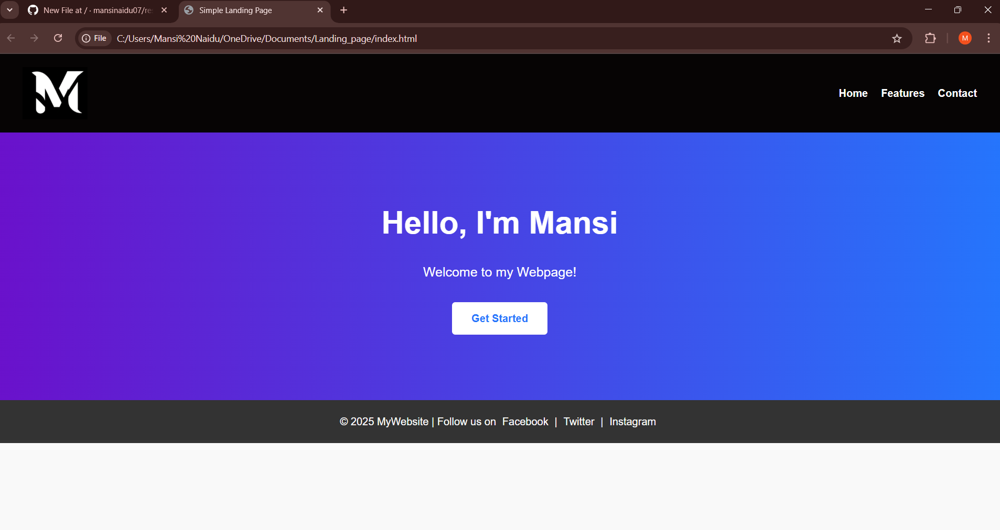

# Responsive Landing Page

This project is a simple responsive landing page built using HTML and CSS.

## Features

- Header with logo and navigation menu  
- Hero section with headline, paragraph, and call-to-action (CTA) button  
- Footer with social media links  
- Fully responsive design using Flexbox and media queries for seamless viewing on different devices  

## Tools Used

- Visual Studio Code (VS Code)  
- Live Server extension for real-time preview  
- Google Chrome browser for testing  

## Screenshots

